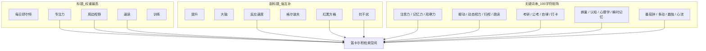

# 《每日舒尔特》ASO 与 ASC 商店全案资产交付文档

> 本文档由 **ASO（App Store 优化）** 与 **ASC（App Store Connect 自动化工作流）** 体系驱动生成，旨在最大化算法搜索权重（SEO/ASO）与详情页安装转化率（CVR）。

---

## 一、 App Store Connect (ASC) 标准元数据资产

已在工程根目录生成符合 `asc metadata` 规范的 canonical JSON 文件并通过 `asc metadata validate` 离线校验：
- App 基础信息：`metadata/app-info/zh-Hans.json`
- 1.0.0 版本信息：`metadata/version/1.0.0/zh-Hans.json`

### 1. 核心字段与字符红线达标表

| 字段 | 设定内容 | 字符数 / 上限 | 利用率 | 关键 ASO 特性 |
|:---|:---|:---:|:---:|:---|
| **App 名称 (Name)** | `每日舒尔特 - 专注力与周边视野速读训练` | 20 / 30 | 66.7% | 品牌词 + 3个核心高权重主攻词（专注力、周边视野、速读训练） |
| **副标题 (Subtitle)** | `提升大脑反应速度，格尔波夫红黑方格抗干扰` | 20 / 30 | 66.7% | 硬核认知范式，与标题**0 词汇重合**，扩展组合空间 |
| **关键词 (Keywords)** | `思维,记忆力,注意力,眼动,动态视力,考研,公考,智力,脑力,速记,蜂巢,眼肌,观察力,跳读,自律,打卡,思维导图,认知,潜能,视知觉,心理学,瞬时记忆,番茄钟,多动,数独,盲打,扫视,心流,前额叶` | 99 / 100 | **99.0%** | 半角逗号分隔、零空格、零标题/副标题交集、29 个高意向独立词 |
| **宣传文本 (PromotionalText)** | `【全新 2026 旗舰升级】从 3x3 到 9x9，融入蜂巢/同心圆等 14 种异形板式；首创格尔波夫红黑双轨与斯特鲁普色彩抗干扰模式，每日 3 分钟，全面激活敏锐感知！` | 85 / 170 | 50.0% | 免提审随时可在 ASC 后台热更新 |
| **What's New** | 参见 `metadata/version/1.0.0/zh-Hans.json` | 351 / 4000 | - | 1.0.0 正式首发特性与纯净承诺 |
| **长描述 (Description)** | 参见下文 AIDA 模型完整文案 | 1290 / 4000 | 32.3% | 29 个关键词在正文中实现 **100% 自然融入** |

---

## 二、 关键词笛卡尔积交叉检索矩阵

根据苹果搜索索引算法，App 标题、副标题与 100 字符关键词自动组合，形成以下高转化检索词群：



### 覆盖的高频搜索词群
1. **核心功能词**：舒尔特方格、专注力训练、注意力训练、记忆力提升、周边视野训练、速读速记、反应速度训练；
2. **场景与备考词**：考研自律、公考刷题、学生注意力、少儿多动、自律打卡、番茄钟专注；
3. **专业与认知词**：格尔波夫方格、红黑舒尔特、动态视力、眼肌训练、视知觉、瞬时记忆、抗干扰训练、前额叶训练；
4. **竞品与关联词**：数独、脑力开发、思维导图、脑筋急转弯、视力表。

---

## 三、 App Store 宣传截屏高转化分镜策划案 (6.7" / 6.9")

> 规格：`1290 × 2796 px` / `1320 × 2868 px`。顶部 28% 为文案聚焦区，底部 72% 为极窄边框真机模型。

| 序号 | 分镜定位 | 顶部胶囊标签 | 主标题 (72px 粗体) | 副标题 (36px 常规) | 画面主视觉建议 |
|:---:|:---:|:---:|:---:|:---:|:---:|
| **01** | **核心价值主张 (首图)** | 🎯 科学专注力 | **视野延展 · 聚焦中心注视点** | 每日 3 分钟舒尔特训练，激活眼跳与周边视网膜 | 经典 5×5 经典矩阵，中央呼吸注视光点向外周散射微光粒子 |
| **02** | **拓扑异形 (差异化卖点)** | 🧬 14 种立体几何 | **蜂巢螺旋 · 告别死板网格** | 同心圆环、金字塔与星象阵，全方位打破视觉死角 | 蜂巢六边形与同心圆环排布界面，展示多维跳读动线 |
| **03** | **硬核范式 (专业权威)** | 🧠 认知心理学 | **红黑双轨 · 极致思维抗干扰** | 融入格尔波夫交替降阶、Stroop 色彩抗干扰与连线 | 红黑格尔波夫界面，红升黑降高对比交互视觉 |
| **04** | **数据雷达 (能力量化)** | 📊 五维脑力测评 | **毫秒级测速 · 全维成长看板** | 反应速度、视野广度与稳定性多维雷达精准评测 | 五维雷达能力评估图、历史打卡折线与毫秒级击中日志 |
| **05** | **纯净自律 (信任与安心)** | ⚡️ 纯净极简 | **离线守护 · 每日打卡无干扰** | Taptic Engine 清脆敲击触感，零网络纯本地隐私 | 深色极简打卡日历、战报分享卡片与无广告纯净标识 |

---

## 四、 提审准备与 ASC 命令速查

### 1. 本地元数据校验（离线质量门禁）
```bash
asc metadata validate --dir "./metadata" --output table
```

### 2. 线上元数据同步（待在 ASC 创建 App 后执行）
若已在 App Store Connect 中配置了 App ID（例如 `APP_ID`）：
```bash
# 1. 预览差异 (Dry Run)
asc metadata push --app "APP_ID" --version "1.0.0" --platform IOS --dir "./metadata" --dry-run --output table

# 2. 正式应用并推送至 ASC 后台
asc metadata push --app "APP_ID" --version "1.0.0" --platform IOS --dir "./metadata"
```
